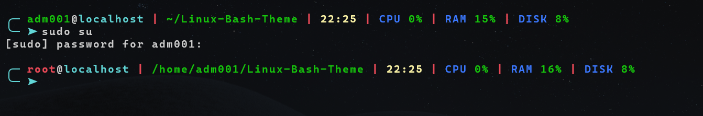

# 🖥️ Terminal Theme (Bash Shell)
## 📸 Preview


---

## ✨ Features

- CPU / RAM / DISK stats
- Root detection (red username)
- Normal user detection (green username)
---
### Backup your current `.bashrc` (IMPORTANT)

Before installing, create a backup:

```bash id="backup1"
cp ~/.bashrc ~/.bashrc.backup
```

## 📦 Installation

### 1. Clone repository

```bash
git clone https://github.com/devsjayanth/Linux-Bash-Theme.git
```

### 4. Install & Apply changes (normal user)

```bash
cd Linux-Bash-Theme
chmod +x install.sh
./install.sh
source ~/.bashrc
exec bash
```

---

## 👑 Root Installation (optional)

If you want the theme for root:

```bash
sudo su
cp /root/.bashrc /root/.bashrc.backup
cd Linux-Bash-Theme
./install.sh
source ~/.bashrc
exec bash
```

---

## 🔁 Restore original bashrc (rollback option)

If anything goes wrong or you want to revert:

```bash
cp ~/.bashrc.backup ~/.bashrc
source ~/.bashrc
```

For root:

```bash
cp /root/.bashrc.backup /root/.bashrc
source ~/.bashrc
```
---

## 🧹 Uninstall and Restore original bashrc

Restore backup:

```bash
cp ~/.bashrc.backup ~/.bashrc
source ~/.bashrc
```
